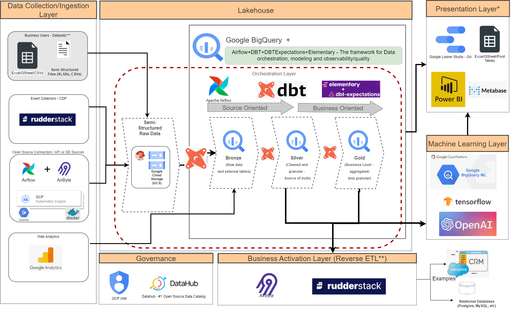

# Bounce - Data Engineer Challenge

## Part 4: Cloud-based Data Stack Architecture Document

Lastly, create a document that describes an architecture for a modern cloud-based data stack. Your architecture should include tools for extraction (ETL), transformation, and analytics.

The document should:

1. Specify the tools/services you recommend for each layer in the stack and provide a brief rationale for each choice.
2. Provide a diagram showing the flow of data through this architecture.
3. Explain any important considerations or trade-offs involved in designing this architecture.

You're free to assume any reasonable constraints or requirements not explicitly stated in the prompt. However, please do note your assumptions clearly in your document.

---

### DIAGRAM:

### EXPLANATION:

The initial assumption is that we are going to run the architecture using the Google Cloud Platform. However, the concepts are cloud-agnostic.

The diagram is split into some layers. Find them below:

1. **Data Collection/Ingestion Layer:**
   The data basically can arrive in our Data Platform from many different types of sources, formats, latency, etc.
   I tried to cover the most common ones, and tried to fit the best tool for each specific scenario:

   * Manual Files (business teams have some Excel Files, Google Sheets, etc they would like to ingest into our lakehouse):
     * a direct ingestion into our Cloud Storage or if it's a Google sheet, just mapped as an external table directly.
     * If it's an Excel file, we could leverage the capabilities from Airbyte to ingest the files into the Cloud Storage (not explicit in the diagram avoiding many arrows and making the reading difficult)
   * Event Collectors: Every event that should be collected from our website, or generated for any other source (like IoT devices, for example):
     * It's possible to collect the events directly using a PUB/SUB pattern for the very beginning, however, I recommend using an Open Source Platform called [Rudderstack](https://www.rudderstack.com/), which provides us with a lot of data collection capabilities combined with some CDP capabilities. They also have a Cloud SaaS solution.
     * If we are not interested in [Rudderstack](https://www.rudderstack.com/), we could simply use [Google PubSub](https://cloud.google.com/pubsub) to receive those events and store them in our Lakehouse (GCS + BQ) --> Again, not explicit on the diagram to avoid confusion about those options. It's a simple trade-off for keeping things simple to start or having a more robust but complex platform to handle.
   * Databases and APIs/Webhooks: SQL/No-SQL databases, APIs, or Webhooks from our internal products, or external partners.
     * For those scenarios I would say that depends a lot on the source, but I'd say that in 80% of the cases we could use the [Airflow](https://airflow.apache.org/) + [Airbyte](https://airbyte.com) combination.
     * [Airflow](https://airflow.apache.org/) can handle the whole orchestration (including the DBT part that we are going to describe better later on) and also, have the flexibility to call other Python scripts running in containers in our environment. Or either, if it's deployed under the KubernetesExecutor, or using the Google SaaS version called Cloud Composer, it's possible to create scripts using Python to collect that data.
     * [Airbyte](https://airbyte.com) is my favorite one because it already has many connectors to the most famous databases (like MySQL, Postgres, etc) and APIs (Facebook ads API, Google ads API, etc), and also provides a capability to build our own connector using the Airbyte SDK. This can accelerate a lot of new data collection.
   * Web Analytics Platforms: Any Analytics platform (like [Googe Analytics](https://analytics.google.com/)):
     * If we choose GA4, it's automatically integrated into our Google BigQuery (with some limitations if we don't pay for the GA360, but it's another topic)
     * If we have any other tool, the event collection falls into the Event Colletors topic or API topic.
2. **Lakehouse (CORE):**
   We have here the traditional pieces of the default Medallion architecture: Bronze, Silver, and Gold Layers. I just created a representation of the Raw data from the bronze layer in GCS as well, because in many cases we need to store raw data in GCS. The Bronze layer can consume from the "raw" JSON files in GCS simply creating external tables. I just reinforced it in the diagram. However, sometimes we can store physical tables directly in the Bronze layer (like GA events, for example)

   * The Bronze Layer contains the Raw data without any transformations.
   * The Silver Layer: we have the matched, deduplicated, cleansed, and conformed data.  It brings the data from different sources into an Enterprise view and enables self-service analytics for ad-hoc reporting, advanced analytics, and ML.
   * The Gold Layer: it's typically organized in consumption-ready "project-specific" databases. Basically, for reporting and more de-normalized and read-optimized data models with fewer joins. Having OBTs (One big table) is a common pattern in this layer.

   To transform the data, [DBT](https://www.getdbt.com) is by far my preferred one. Many reasons: Easy to learn, easy to run, flexible to add new Jinja macros, etc.

   To Data Observability and Quality, I like the combination of the [DBTExpectations](https://github.com/calogica/dbt-expectations) (a kind of Great Expectations port for DBT) + [Elementary](https://www.elementary-data.com). It can help us to integrate the alerts to Slack, create some dashboards to monitor the DBT runs, etc.
3. **Presentation Layer:**

   * I've put some options because, in my opinion, we should democratize the data, so the better for a specific user will be the best for the company. For example, The Finance Team loves to use Excel to consume the data, but the Marketing Team likes to use [Metabase](https://metabase.com) or [Microsft Power BI](https://www.powerbi.com), or any other self-service exploratory tool.
   * I'd say that's hard to define a unique way to consume the data. But if I have to select one, I'd go by [Microsft Power BI](https://www.powerbi.com), because it's cheaper and robust enough to create all the possible analyses. If we have to limit our budget, [Google Looker Studio](https://lookerstudio.google.com/) is free and it can also be an option. Metabase is very famous, but we need to take care of the infrastructure using the open-source version (the paid version for me is less interesting than Power BI and it's the same price)
     In short, we need to understand the company's direction to define the DataViz tools
4. **ML Layer:**

   * I'm not a specialist in this area, but we have to provide capabilities to our Data scientists to develop, build, train, and run the models. I believe the Google BigQuery ML + TensorFlow can run most of the models that we build in-house.
   * We are also capable to integrate with the LLM models like ChatGPT and Google Bard.
5. **Governance Layer:**

   * I could go further but I'd like to highlight 2 pieces. Data Catalog and IAM.
   * Data Catalog: I liked the open-source solution called [DataHub Project](https://datahubproject.io/). It's easy to integrate with the stack, and very interesting capabilities to identify and classify the data, in a collaborative way with the business users.
   * IAM: [Google IAM](https://cloud.google.com/iam) is the main key to defining specific access in our datasets, including row-level security.
6. **Business Activation (Reverse ETL) Layer:**

   * We have 2 tools ([Airbyte](https://airbyte.com) and [Rudderstack](https://www.rudderstack.com/)) already in the stack capable to get the data from our Lakehouse and re-ingest into applications (I've put some examples like CRM and other internal product databases/APIs). PS: Airbyte Reverse ETL is not General Available yet, but they have it in their roadmap for Q4-2023.

Hope the architecture is well described with the main components that I believe we have to implement to have an initial and reliable data platform. I'm open to discussing it during the next interviewing steps.
